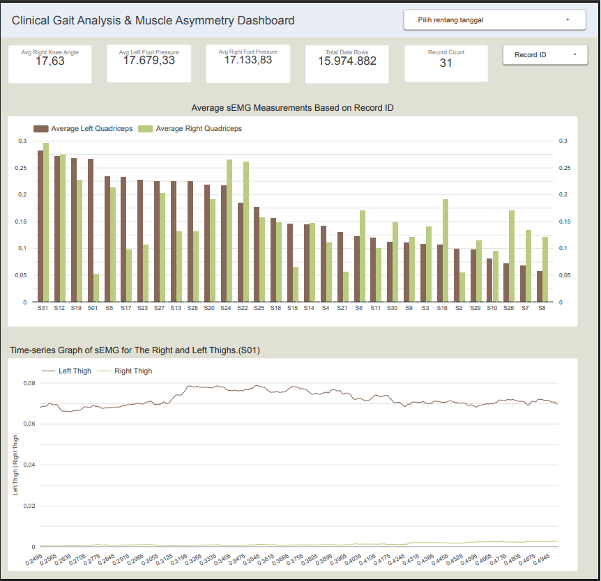

# End-to-End Project: Gait Analysis Data Pipeline & Dashboard

 *(Note: Replace this path if your screenshot is named differently, or remove this line if not using an image)*

🔗 **[Link to Interactive Looker Studio Dashboard][https://datastudio.google.com/u/0/reporting/47751361-d6fc-4936-9f71-53a858f6d0e4/page/60g2F/edit]**

## 1. Executive Summary
This project aims to build an end-to-end data pipeline architecture to process, analyze, and visualize interdisciplinary Gait Analysis data. By leveraging a combination of Data Engineering techniques using Python and SQL, alongside Data Visualization through Google Looker Studio, this project successfully processed large-scale data (**Big Data**) consisting of **15,974,882 rows** of raw signal data originating from 31 test subjects (Record ID S01 to S31).

The primary focus of this analysis is to prove the phenomenon of muscle electrical asymmetry (Muscle Asymmetry) and perform gait biomechanics validation to produce an accurate, intuitive clinical report that is ready for remote reporting needs.

---

## 2. Tech Stack Summary (Technology Matrix)
Below are the primary technologies utilized throughout the data lifecycle of this project:

| Core Function | Technology | Project Implementation |
| :--- | :--- | :--- |
| **Data Engineering & Cleansing** | Python (Pandas, NumPy, Glob) | Automated batch file extraction, noise removal, and implementation of *Min-Max Normalization* on sEMG signals. |
| **Data Storage & Aggregation** | SQL (SQLite) | Structured architecture storage (15+ million rows) and writing aggregation queries for subject-level summary extraction. |
| **Data Visualization & UI/UX** | Google Looker Studio | Interactive dashboard design, time-series visualization, and unified axis scaling adjustments for actionable insights. |

---

## 3. Data Pipeline Architecture
The data workflow in this project is divided into three distinct, structured stages:

1. **Data Extraction & Engineering (Python):** The stage of reading time-based raw signal files, performing initial data cleaning, and applying mathematical transformations such as sensor amplitude normalization.
2. **Data Storage & Transformation (SQL/SQLite):** Loading the processed data into the relational database `gait_analysis_bigdata.db` and executing advanced aggregation queries to summarize macro features per subject.
3. **Data Visualization & UI/UX Design (Looker Studio):** Connecting the relational database to the visualization platform to build an interactive dashboard for clinical and management stakeholders.

---

## 4. Stage 1: Raw Signal Extraction and Processing (Sensor Fusion)

### 4.1 Sensor Component Description
This project implements the concept of *Sensor Fusion* by unifying three types of physical sensors that record subject activity simultaneously:
* **Surface Electromyography (sEMG):** Captures micro-volt electrical signals from muscles to measure the contraction intensity of the front thigh muscle (Rectus Femoris / REC) and rear thigh muscle (Hamstring / HAM) on both the left (LT) and right (RT) legs.
* **Goniometer (Gonio):** Measures joint kinematics in the form of real-time rotational angle changes at the right knee joint (`gonio RT KNEE`) and right hip joint (`gonio RT HIP`).
* **Basograph (Baso):** Plantar pressure sensors attached to the left foot sole (`baso LT FOOT`) and right foot sole (`baso RT FOOT`) to detect physical foot contact with the floor during the gait cycle.

### 4.2 sEMG Signal Amplitude Normalization
Raw sEMG electrical signals have baseline amplitude variations that are heavily influenced by skin thickness and physiological conditions across individuals. To ensure a fair comparison, a *Min-Max Normalization* technique was executed using a Python script to map all signal values into a uniform scale of 0.0 to 1.0 (where 0.0 represents complete relaxation and 1.0 represents Maximum Voluntary Contraction/MVC). 

```text
Signal_Norm = (Signal - Signal_Min) / (Signal_Max - Signal_Min)

```

---

## 5. Stage 2: Relational Database Management & Data Quality (SQL)

### 5.1 Summary Data Structure and Aggregation Queries

For macro visualization purposes, the massive time-series data was transformed into feature-level summary data using SQL queries in SQLite. Below is the optimized SQL query used to extract all sensor averages per subject:

```sql
SELECT 
    record_id,
    COUNT(*) AS total_baris_data,
    
    -- 1. Muscle Electrical Metrics (sEMG)
    ROUND(AVG("semg LT REC.F_norm"), 4) AS rata_paha_depan_kiri,
    ROUND(AVG("semg RT REC.F_norm"), 4) AS rata_paha_depan_kanan,
    ROUND(AVG("semg LT HAM_norm"), 4) AS rata_paha_belakang_kiri,
    ROUND(AVG("semg RT HAM_norm"), 4) AS rata_paha_belakang_kanan,
    
    -- 2. Joint Angle Metrics (Goniometer)
    ROUND(AVG("gonio RT KNEE_sync"), 2) AS rata_sudut_lutut_kanan,
    ROUND(AVG("gonio RT HIP_sync"), 2) AS rata_sudut_pinggul_kanan,
    
    -- 3. Plantar Pressure Metrics (Basograph)
    ROUND(AVG("baso LT FOOT_sync"), 2) AS rata_tekanan_kaki_kiri,
    ROUND(AVG("baso RT FOOT_sync"), 2) AS rata_tekanan_kaki_kanan
FROM 
    gait_master_features
GROUP BY 
    record_id
ORDER BY 
    record_id ASC;

```

### 5.2 Root Cause Analysis: Anomaly Detection and Data Integrity

During the data quality audit on the extracted CSV files, two crucial issues were discovered that required an analyst's technical decision:

1. **Sensor Saturation (Clipping) on Subject S21:** The `rata_sudut_pinggul_kanan` column showed an extreme anomalous value of `16,386.85` specifically for subject S21. In terms of hardware, this number aligns with the upper limit of a 14-bit digital system ($2^{14} = 16,384$). This indicates that *sensor saturation* or a short circuit occurred during recording.
2. **Missing Values:** The right hip goniometer sensor had numerous empty rows across various subjects due to field equipment attachment constraints.

> **Analytical Decision:** Adhering to the principle of data integrity (*Garbage In, Garbage Out*), the right hip angle metric was completely excluded from the main dashboard to prevent distorting the population's average reporting values.

---

## 6. Stage 3: Dashboard Design & UI/UX Visualization (Looker Studio)

### 6.1 Hero Metrics (Scorecards) & Aggregation Logics

The upper section of the dashboard is designed as an executive summary panel by applying several primary indicators:

* **Total Data Rows:** Utilizes the `SUM` aggregation function to reflect the total data processing volume (15,974,882 rows).
* **Record Count:** Displays the total unique sample of subjects (31 subjects).
* **Avg Right Knee Angle:** Uses the `AVERAGE` aggregation function (not SUM) to generate a clinically valid anatomical value, which stands at 17.63°.
* **Avg Left & Right Foot Pressure:** Displays the average plantar pressure levels to detect the symmetrical distribution of the body's biomechanical load.

### 6.2 Macro View: Muscle Electrical Comparison Analysis

A bar chart is used to compare the average workload of the left thigh muscle (Average Left Quadriceps) and right thigh muscle (Average Right Quadriceps) across all test subjects.

* **Troubleshooting:** By default, Looker Studio grouped the 11th subject onwards into a single massive bar named "Others," which broke the Y-axis scale. This issue was resolved by disabling the "Group 'Others'" setting and increasing the Row Limit to 50.

### 6.3 Micro View: Single-Axis Time-Series Signal Analysis

To dissect muscle movement from millisecond to millisecond, a specific time-series file (`timeseries_S1.csv`) was linked to the canvas using a line graph based on the time dimension.

* **Principle of Visual Honesty (Unified Axis Scaling):** Looker Studio automatically applied Dual Y-axes with different upper limits, misleading the reader's eye into thinking the two muscles were balanced. By forcing both metric series to the same **Left Axis**, this visual manipulation was eliminated. The graph reveals the objective clinical reality of subject S01: the right thigh muscle experiences extreme weakness, while the left thigh muscle bears the entire contraction load.

---

## 7. Actionable Insights (Data-Driven Recommendations)

Based on the muscle asymmetry and biomechanical pressure analyzed on the dashboard, the following are strategic, actionable recommendations for clinical practitioners:

* **Precision Physiotherapy Intervention:** Patients with extreme contraction gaps (asymmetry) exceeding 20% between the left and right legs (as observed in profile S01) are recommended for immediate referral to a unilateral strength training program to prevent compensatory joint damage in the future.
* **Equipment Re-calibration:** The discovery of sensor value anomalies in the hip angle highlights the need for hardware maintenance and stricter sensor placement protocols before subsequent experiments are conducted.

---

## 8. Future Enhancements

To improve system scalability and automation, this data architecture can be further expanded through:

* **Automated Data Quality Alerting:** Developing an additional Python module using statistical calculations (such as *Z-Score* or *Interquartile Range*) to automatically discard outliers or trigger alerts when sensor saturation is detected (e.g., values > 16,000) before data is loaded into the database.
* **Migration to a Cloud Data Warehouse:** Integrating the pipeline from a local SQLite setup into a cloud infrastructure like Google BigQuery to facilitate real-time streaming of IoT data with substantially higher query performance.

---

## 9. Conclusion

Through the implementation of this data pipeline and visualization, a solid clinical conclusion was reached that the majority of subjects exhibit gait asymmetry, with a clear tendency toward movement compensation in the left thigh muscle. From a professional standpoint, this end-to-end project demonstrates mature analytical competencies: expertise in Python automation programming, sharp data quality auditing via SQL, and a high-level understanding of dashboard UI/UX that is highly valuable for modern Data Analyst roles.

```

```
